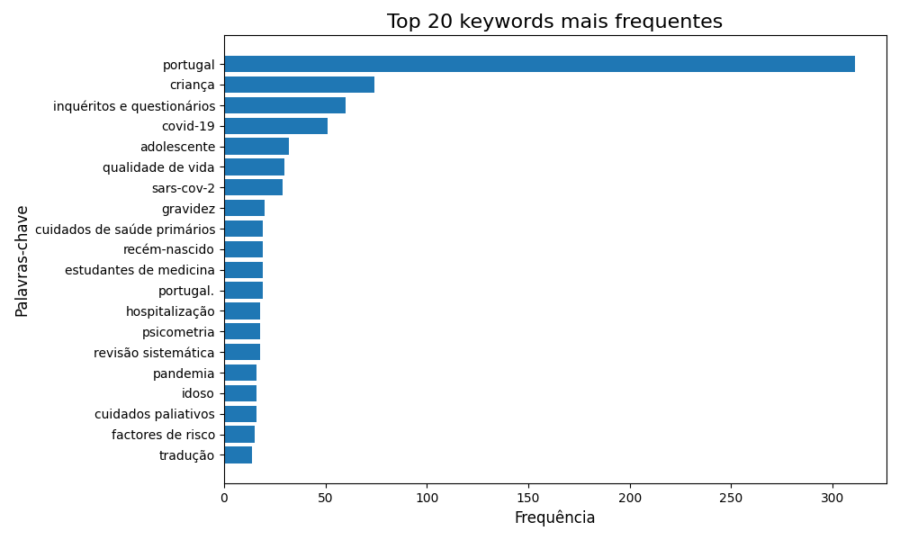
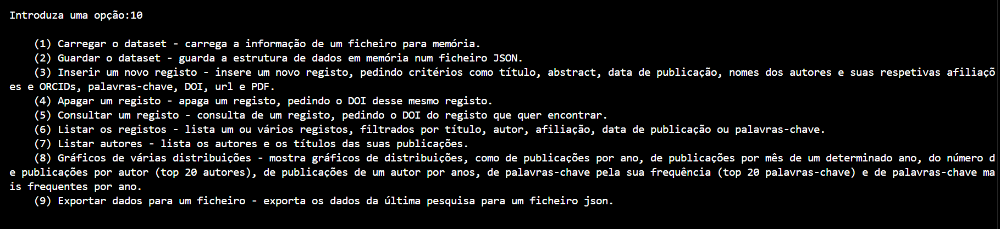

# Relatório Projeto final 2024/2025

## **Docentes responsáveis**:
José Carlos Ramalho e Luís Filipe Cunha

## **Autores**:
**Ana Carolina Guimarães**, a107196, LEB;
**Andriana Smoliy**, a107188, LEB;
**Matilde Campos**, a107190, LEB

## Resumo:
No âmbito da UC "Algoritmos e Técnicas de Programação" do 2º ano da Licenciatura em Engenharia Biomédica do ano letivo 2024-2025, a proposta para o projeto final consistiu no desenvolvimento de um sistema em Python que permitisse criar, atualizar e analisar publicações científicas. Com base num dataset de publicações, o sistema possibilita a pesquisa de artigos usando filtros relevantes, tais como a data de publicação, as palavras-chave, autores, etc. Além disto, também são gerados gráficos detalhados para a análise de métricas dos artigos e dos seus autores.

## Funcionamento do sistema
O nosso sistema apresenta dois tipos de interface:
- Interface de linha de comando (CLI)
- Interface gráfica

## Interface de linha de comando (CLI)

No que diz respeito à CLI, o sistema inicializa-se com a apresentação do menu:

Como visualizado, o menu permite carregar o dataset para memória, guardar a estrutura de dados em memória num ficheiro JSON, inserir um novo registo, apagar o registo correspondente através de um identificador de uma publicação (como o DOI), consultar a informação de um registo com base no seu identificador, listar os registos tendo em conta vários filtros (como o título, autor, afiliação, data de publicação e palavras-chave), listar todos os autores existentes no sistema (por ordem decrescente de número de artigos) e o título das suas publicações, permite mostrar gráficos de várias distribuições com o auxílio da biblioteca Matplotlib, exportar dados para um ficheiro e, por fim, emite uma mensagem de ajuda.

Deste modo, com o uso do ciclo while na estrutura da app principal, o programa fica constantemente a testar o que o utilizador realiza - enquanto o utilizador não selecionar a opção 0) Sair, o sistema fica em constante funcionamento.

## Descrição das funções do menu (CLI)
- **Opção 1** - A função 'carregarBD' é chamada. Esta função recebe um ficheiro (fnome) e abre-o (open), carregando a sua informação para a memória (mybd). Posteriormente, o ficheiro é fechado retornando mybd. 
Na opção 1 do menu, inicialmente assumimos que o dataset não foi carregado atribuindo-lhe o valor boleano False. Como o dataset ainda não foi carregado chamamos a função 'carregarBD' e, por isso, o valor boleano do dataset passa a True. Caso o dataset já tenha sido caregado anteriormente, a função faz print de uma mensagem a dizer que já foi carregado.

- **Opção 2** - A função 'guardarBD' recebe a base de dados (mybd) e o ficheiro onde se deseja guardar os dados. Assim, o ficheiro é aberto no modo escrita ("w") e é carregado com os dados de mybd. Quando o ficheiro é fechado, surge uma mensagem de sucesso.

- **Opção 3** - A função 'inserir_registo' recebe mybd e, primeiramente, o utilizador faz o input de cada campo do registo. Nos casos em que a cada autor corresponde uma afiliação e um orcid é pedido que os nomes dos autores, as afiliações e os orcids sejam escritos separados por vírgulas para posteriormente se utilizar o 'split(",")'. Optamos também por criar uma condição em que se verifica se o número de autores introduzido é menor que o número de afiliações. Nesse caso, surge o print de uma mensagem de erro, uma vez que o número de afiliações é maior ao número de autores, retornando o dataset.
De seguida, criamos uma lista vazia e usamos uma variável 'i' para percorrer a lista proveniente do 'split'. Para o campo author criamos um dicionário onde associamos as chaves "name" e "affliation" aos respetivos valores.
Além disto, a função verifica tambem se há um ORCID fornecido para o autor.
Se o número da posição de cada autor for menor que o número de orcids fornecido, então 'author["orcid"]' vai ser associado a 'orcids[i]'. Caso o número de ORCIDs seja menor que o número de autores, esta condição assegura que o ORCID seja atribuído apenas aos autores para os quais o ORCID foi fornecido. Se o autor tiver um ORCID correspondente, ele é adicionado ao dicionário author sob a chave "orcid". O valor é o ORCID correspondente do autor. No final, adiciona-se o dicionário 'author' à lista 'author_list' previamente inicializada como vazia. Cada autor, com o seu nome, afiliação e possivelmente ORCID, será adicionado à lista de autores que será finalmente incluída no novo registo. Para prevenir introduzir registos com o mesmo DOI, optamos por verificar se há registos em mybd com o mesmo DOI que o DOI do novo registo. 
Para finalizar, adiciona-se o novo registo à base de dados mybd e faz-se print do mesmo.

- **Opção 4** - A função 'apagar' recebe a base de dados e o identificador do registo, ou seja, o DOI. A função usa 'enumerate' para obter o índice de cada registo (para utilizar 'del' é necessário o índice do elemento a ser apagado). Para cada registo, verifica se o valor do campo "doi" é igual ao DOI fornecido. Se encontrar o DOI, o registo é removido da lista usando 'del', e a função imprime uma mensagem informando que o registo foi apagado.
Após apagar o registo, a função retorna a lista atualizada mybd.
Se o DOI não for encontrado em nenhum registo, a função imprime uma mensagem a dizer que o DOI não foi encontrado e retorna a lista original sem alterações.

- **Opção 5** - A função 'consultarD' recebe a base de dados e o DOI tal como a função 'apagar'. Percorrendo a lista, para cada registo em mybd, se o valor do campo "doi" for igual ao DOI fornecido, a função retorna o registo correspondente a esse DOI.

- **Opção 6** - A função 'listar_publicacoes' é um submenu que permite buscar publicações à base de dados mybd tendo em conta vários critérios de pesquisa. O programa apresenta ao utilizador vários critérios dos quais ele deve escolher um. Inicializamos uma variável 'resultados' como sendo uma lista vazia. Deste modo, se a opção escolhida for:

    - **Escolha 1** (por título) - Solicitamos ao utilizador o título do artigo. Percorrendo o dataset, em cada registo, primeiro, verificamos se existe o campo "title" em cada publicação e, caso exista, comparamos o título inserido com o título de cada publicação, ignorando diferenças de maiúsculas e minúsculas (lower()). Se o título for encontrado, o registo é adicionado à lista 'resultados', retornando-a.
    

    - **Escolha 2** (por autor) - Solicitamos ao utilizador o nome do autor. Percorrendo a lista de autores de cada registo existente no dataset, comparamos o nome do autor inserido com o nome do(s) autor(es) da publicação. Se o nome do autor for encontrado, o registo é adicionado à lista 'resultados', retornando-a.
    

    - **Escolha 3** (por afiliação) - Solicitamos ao utilizador a afiliação. Percorrendo a lista de autores de cada registo existente no dataset, primeiro, verificamos se existe o campo "affiliations" (já que alguns autores não estão associados a uma afiliação) e, caso exista, comparamos a afiliação inserida com a afiliação do(s) autor(es) da publicação. Se a afiliação for encontrada, o registo é adicionado à lista 'resultados', retornando-a.
    

    - **Escolha 4** (por data de publicação) - Solicitamos ao utilizador a data de publicação. Percorrendo o dataset, em cada registo, primeiro, verificamos se existe o campo "publish_date" e, caso exista, comparamos a data inserida com a data de cada publicação. Se a data for encontrada, o registo é adicionado à lista 'resultados', retornando-a.
    

    - **Escolha 5** (por palavra-chave) - Solicitamos ao utilizador uma palavra-chave. Percorrendo o dataset, em cada registo, primeiro, verificamos se existe o campo "keywords" e, caso exista, verificamos se a palavra-chave inserida (convertida para minúsculas através do 'lower()' e sem espaços desnecessários no início ou fim com o 'strip()') se encontra na lista, criada pelo 'split(",")', das palavras-chave da publicação (também em minúculas e sem os espaços desnecessários). Se a palavra-chave for encontrada nessa lista, o registo é adicionado à lista 'resultados', retornando-a. O 'strip()' é importante aqui, pois, no dataset, as palavras-chave depois da primeira contêm espaços antes do seu início, ou seja, na lista criada pelo 'split(",")' iriam continuar com esses espaços no início e não seriam encontrados, pois faltaria um espaço nad palavra-chave inserida.
    

- **Opção 7** - A função 'listar_autores' recebe a base de dados mybd. Inicializamos um dicionário para posteriormente acrescentar as publicações dos autores. Por cada registo em mybd, obtemos o título da publicação. Por cada autor na lista de autores, obtemos o nome dos autores. Caso esse nome não esteja no dicionário, adicionamos uma lista correspondente a esse autor; caso o autor já esteja na lista adiciona-se o título da publicação. No final, retorna-se o dicionário das publicações dos autores.
Assim, criamos uma lista 'resultado' vazia para, no fim, adicionarmos a informação de forma organizada. Estabelecemos um critério de organização pela ordem decrescente (reverse=True) do número de registos de cada autor (len(publicacoes_autores[nome]). À lista adicionamos o nome do autor e os títulos das publicações a ele associadas, e uma linha em branco para uma melhor leitura, retornando-a.

- **Opção 8** - No que diz respeito aos gráficos das várias distribuições, utilizamos o decidimos criar um menu onde o utilizador digita o número da distribuição que deseja visualizar graficamente. Se a opção escolhida for:

    - **Escolha 1** - Será mostrada a 'distribuição de publicações por ano'. Inicializamos uma variável 'distribuição' como dicionário vazio onde a chave será o ano e o valor o número de publicações desse ano . Posteriormente verificamos se existe a chave "publish_date" bem como o seu valor correspondente. Caso isto se verifique o obtemos o ano de cada publicação através de pub["publish_date"][:4]. Se o ano já estiver no dicionário, acrescentamos 1 publicação ao seu valor; caso contrário atribuimos-lhe 1 publicação. Quanto à criação do gráfico de barras, primeiramente decidimos quais as variáveis que irão fazer parte do mesmo, isto é, os anos no eixo Ox e as contagens no eixo Oy. Para obter os anos por ordem crescente, utlizamos as chaves da nossa distribuição; quanto às contagens, por cado ano, adquirimos o seu valor. Para que o gráfico não fique cortado nem sobreposto utiliza-se plt.tight_layout().

    
    

    - **Escolha 2** - Será mostrada a 'distribuição de publicações por mês de um determinado ano'. Inicializamos um dicionário vazio onde as chaves serão o mês de um determiando ano e os valores corresponderão ao número de publicações desse mês. Por publicação na base de dados, verificamos se existe a chave "publish_date" bem como o seu valor correspondente. Em caso afirmativo, obtemos o ano e o mês da publicação. De seguida, comparamos o ano da publicação com o ano fornecido pelo utilizador. Se o mês já existir no dicionário, soma-se 1 ao valor existente.Se não existir, inicializa o valor como 0 e depois adiciona 1. Quanto à criação do gráfico de barras, decidimos quais as variáveis que irão fazer parte do mesmo, isto é, os meses no eixo Ox e as contagens no eixo Oy. Para obter os anos por ordem crescente, utlizamos as chaves da nossa distribuição; quanto às contagens, por cada mês, adquirimos o seu valor.
    
    

    - **Escolha 3** - Será mostrada a 'distribuição do número de publicações por autor (top 20 autores)'. Inicializamos um dicionário vazio onde as chaves serão os autores e os valores corresponderão ao número de publicações desse autor. Por publicação na base de dados, verificamos se existe a chave "authors". Em caso afirmativo, percorremos a lista dos autores para obter os seus nomes. Se este nome já estiver no dicionário acrescenta-se 1 ao seu valor, senão acrescenta-se ao dicionário. 
    Para obter o top 20 autores, aplicamos 'items()' que cria uma lista com as chaves (autores) e os valores (respetivo número de publicações). Com a combinação do 'sorted' e do reverse = True ordenamos por odem decrescente o número de publicações de cada autor. Ao usar o slicing [:20] obtemos o top 20 de autores com mais publicações.
    Quanto à criação do gráfico, decidimos quais as variáveis que irão fazer parte do mesmo, isto é, o número de publicações no eixo Ox e os nomes dos autores no eixo Oy. Para obter o número de publicações de cada autor acedemos a autor[1] da lista dos top 20 autores e no caso dos nomes dos autores acedemos a autor[0]. Por fim, criamos um gráfico de barras horizontal onde o autor com mais publicações surge no topo.
    
    

    - **Escolha 4** - Será mostrada a 'distribuição de publicações de um autor por ano'. Inicializamos um dicionário vazio onde as chaves serão os anos e os valores corresponderão ao número de publicações desse autor ao longo dos anos. Por publicação na base de dados, verificamos se existe a chave "authors". Se sim, percorremos a lista dos autores para obter os seus nomes e verificamos se o nome dos autores da base de dados é igual ao nome do autor desejado pela pessoa. Em caso afirmativo, analisamos se a chave "publish_date" existe na base de dados e se tal se verificar obtemos o ano da publicação. Se esse ano já estiver no dicionário adiciona-se um valor ao respetivo ano; caso contrário adiciona-se o ano ao dicionário atribuindo-lhe 1 publicação.
    Para obter os anos ordenados aplicamos o 'sorted()' juntamente com 'items()' ao nosso dicionário.
    Quanto à criação do gráfico, decidimos quais as variáveis que irão fazer parte do mesmo, isto é, os anos no eixo Ox e o número de publicações no eixo Oy. Para obter o número de publicações do autor pretendido acedemos a ano[1] da lista com os anos ordenados e para os anos acedemos a ano[0].
    
    
    
    - **Escolha 5** - Será mostrada a 'distribuição de palavras-chave pela sua frequência (top 20 palavras-chave)'. Inicializamos um dicionário vazio onde as chaves corresponderão à frequência de cada palavra-chave e os valores serão as palavras-chave. Por publicação na base de dados, verificamos se existe a chave "keywords". Se sim, obtemos as palavras-chave através de 'split(", ")'. Se cada palavra-chave (convertida para minúscula) já estiver no nosso dicionário então o valor dessa palavra-chave acresce de 1; caso contrário atribui-se o valor 1 a essa palavra-chave.
    Para obter o top 20 das palavras-chave usamos o mesmo raciocínio para o top 20 autores.
    Para obter as palavras-chave usamos item[0] por cada palavra na lista de top 20 palavras. Para obter a frequência destas palavras-chave usamos item[1].
    Quanto à criação do gráfico de barras horizontais, decidimos quais as variáveis que irão fazer parte do mesmo, isto é, a frequência no eixo Ox e as palavras-chave no eixo Oy.
    
    

    - **Escolha 6** - Será mostrada a 'distribuição de palavras-chave mais frequentes por ano'. Pedimos ao utilizador que introduza o ano que deseja consultar e inicializamos um dicionário vazio onde as chaves corresponderão aos anos e os valores serão outro dicionário com as palavras chaves e a sua frequência para esse ano. Por publicação na base de dados, verificamos se as chaves "keywords" e "publish_date" existem na base de dados e, em caso afirmativo, extraimos o ano da publicação e as palavras-chave (através do 'split(", ")'). Por cada palavra-chave, o código é capaz de remover espaços em branco no ínicio e no fim da palavra, converter para minúscula e verifica se o ano da publicação já está no dicionário (se não estiver incializa um novo dicionário vazio para ele). Se a palavra-chave já existir no dicionário incial, incrementa a contagem, se não existir incializa-se a contagem dessa palavra-chave com 1.
    Antes de criar o gráfico, verificamos se o ano desejado existe no dicionário inicial. Se o ano existir então a variável 'palavras' recebe o dicionário com as palavras-chave e as suas respetivas frequências para o ano; ordena as palavras-chave em ordem decrescente de frequência e capta as 20 palavras mais frequentes. De seguida, criamos 2 listas: uma que contém as palavras-chave (chaves do dicionário) e outra que contém a frequência dessas palavras (valores do dicionário).
    Quanto à criação do gráfico de barras horizontais, decidimos quais as variáveis que irão fazer parte do mesmo, isto é, a frequência no eixo Ox e as palavras-chave no eixo Oy.
    
    
    

- **Opção 9** - A função 'exportar_dados' abre um ficheiro json de nome fornecido pelo utilizador (fnome) em modo escrita ("w"). Depois de aberto, a função faz um 'dump', ou seja, carrega os dados da última pesquisa feita para o ficheiro novo. No menu, se não houver dados para carregar, recebemos uma mensagem de erro.

- **Opção 10** - A função 'help' tem como função explicar o que cada função disponibilizada pelo programa faz ao utilizador. Nela fazemos um print da mensagem que queremos que seja apresentada ao utilizador.

## Interface gráfica

Quanto à interface gráfica, com auxílio da biblioteca FreeSimpleGUI, é nos mostrada uma janela principal com vários botões de cada comando, o layout, e uma caixa onde vão ser expostos os dados realizados por cada comando.

 
Como visualizado, o menu tem os mesmos comandos do menu da interface de linha de comando (CLI) exceto o HELP. Contamos com vários botões, cada um associado a uma chave (key), e a caixa 'Multiline'.

Começamos com uma uma lista vazia de nome de variável 'dataset'. Ora, o chamado "Event listener" é o código que vai disponibilizar uma funcionalidade específica a cada botão criado no layout. A variável 'stop' com valor boleano False vai controlar o loop do 'while', ou seja, quando o utilizador clica em "Sair" ou fecha a janela, o primeiro evento, 'stop' passa a ter um valor boleano True, quebrando o loop e fechando a janela (window.close()).
Nos restantes eventos, é chamada a função correspondente à funcionalidade que corresponde cada botão, fazendo uma atualização (update) da caixa na janela principal (caso haja dados) através de um 'json.dump'. No caso do evento das distribuições, como é usada a biblioteca Matplotlib, os gráficos serão criados numa janela diferente e, consequentemente, não vai haver uma atualização da caixa.

## Descrição das funções do menu (interface gráfica)

- **1º evento** - A função 'carregar_dataset' é chamada. A função recebe um ficheiro (fnome), limitado apenas a ficheiros json do computador do utilizador (visualizar menu principal), e tenta abri-lo (try) em modo leitura ('r'), carregando a sua informação para a memória (dataset). Posteriormente, aparece um popup de sucesso no carregamento do dataset. Se acontecer um erro de leitura do ficheiro, aparece um popup "Erro". No fim, retorna-se o dataset.

-  **2º evento** - A função 'guardar_dataset' recebe o dataset e o ficheiro onde se deseja os dados, então, este é aberto em modo escrita ("w") e é carregado com os dados do dataset (json.dump). Com os dados gravados surge um popup de sucesso. Caso aconteça um erro na leitura do ficheiro, surge um popup de "Erro".

- **3º evento** - Na função 'inserir_reg', como o utilizador tem de fornecer informações, cria-se uma nova janela, onde contém um layout onde se pode preencher (através do 'sg.Input') cada critério necessário para o novo registo e, também, os botões "Adicionar" e "Cancelar". Posteriormente, usa-se um ciclo 'while' e outra vez a variável 'stop'. No evento do botão "Adicionar", associa-se a cada informação disponibilizada pelo utilizador (values[key], sendo "key" a chave associada ao botão) a uma variável. Tal como na função de inserir registos da interface de linha de comando, nos casos em que a cada autor corresponde uma afiliação e um orcid é pedido que os nomes dos autores, as afiliações e os orcids sejam escritos separados por vírgulas para posteriormente se utilizar o 'split(",")'.
Depois, uma condição é implementada em que se verifica se o número de autores introduzido é menor que o número de afiliações. Nesse caso, surge um popup de uma mensagem de erro, uma vez que o número de afiliações é maior ao número de autores. Se não for esse o caso, criamos uma lista vazia e usamos uma variável 'i' para percorrer a lista proveniente do 'split(",")'. Para o campo 'author', criamos um dicionário onde associamos as chaves "name" e "affiliation" aos respetivos valores. Além disto, a função verifica tambem se há um ORCID fornecido para o autor.
Se o número da posição de cada autor for menor que o número de orcids fornecido, então 'author["orcid"]' vai ser associado a 'orcids[i]'. Caso o número de ORCIDs seja menor que o número de autores, esta condição assegura que o ORCID seja atribuído apenas aos autores para os quais o ORCID foi fornecido. Se o autor tiver um ORCID correspondente, ele é adicionado ao dicionário author sob a chave "orcid". O valor é o ORCID correspondente do autor. No final, adiciona-se o dicionário 'author' à lista 'author_list' previamente inicializada como vazia. Cada autor, com o seu nome, afiliação e possivelmente ORCID, será adicionado à lista de autores que será finalmente incluída no novo registo.
Como não podem haver DOI´s duplicados (registos com o mesmo DOI), usamos uma condição que, inicializando com "duplicado=False", comparar os DOI´s de cada registo com o DOI fornecido pelo o utilizador e caso seja encontrado um igual, a variável 'duplicado' passa a ter um valor boleano True.
Assim, se houver um duplicado, vai aparecer uma mensagem de erro e, caso não haja adiciona-se o novo registo à base de dados 'dataset', retornando-a.

- **4º evento** - Na função 'apagar_reg', comçamos por criar uma janela com um layout onde o utilizador vai introduz o DOI do registo que quer apagar e que contém os botões para confirmar e cancelar o comando. No ciclo 'while', no evento da chave do botão "Confirmar", associa-se o 'input' do DOI à variável 'doi'. Começamos com uma variável 'eliminado' com o valor boleano False, este que vai controlar a procura do DOI. Usamos o 'enumerate' para associar cada registo ao seu índice. Para cada registo, verifica-se se o valor do campo "doi" é igual a 'doi'. Se encontrar o DOI, o registo é apagado (usando 'del'), aparecendo um popup de sucesso e mudando o valor de 'eliminado' para True. Se o DOI não for encontrado, é nos mostrado um popup de insucesso. Após, se o registo for apagado ou o DOI não for encontrado, a janela é fechada e é retornado o dataset.

- **5º evento** - Para a função 'consultar_reg' começamos com a criação de uma janela com um layout onde o utilizador insere o DOI do registo que pretende consultar, e os botões de confirmar e cancelar. No ciclo 'while', no evento da chave do botão "Confirmar", associa-se o 'input' do DOI à variável 'doi' e assumimos um 'reg_encontrado' como None (registo não encontrado). A função, então, vai comparar o DOI de cada registo que percorre com o 'doi' e, caso seja igual igualamos 'reg_encontrado' ao registo do DOI encontrado e é mostrado um popup de sucesso. Caso o DOI não encontrado (reg_encontrado=None), aparece um popup de insucesso. Para finalizar, a janela é fechada é é retornado 'reg_encontrado'.

- **6º evento** - A função 'menu_filtros', é um submenu que permite consultar várias publicações usando filtros de pesquisa de critérios. O programa abre uma janela onde é apresentada uma layout com botões para a pesquisa por cada critéio, mais o botão de cancelar. Assumimos uma variável 'resultado' como None, para, mais tarde, ser igualada aos dados provenientes da filtração do dataset pelo critério escolhido e retornada depois que a janela fecha. 

    - **1º evento** (por título) - É chamada a função 'filtrar_reg'. Nesta função, e´criada outra janela onde observamos os botões confirmar e cancelar e o local onde é pedido ao utilizador para digitar o título. No ciclo 'while', no evento associado à chave do botão "Confirmar", associamos o título introduzido a 'title'. Criamos uma lista vazia onde vai ser adicionada o registo que contém o título introduzido, por meio de comparação entre 'title' e os títulos de cada registo (ignora-se diferenças de maiúsculas e minúsculas, usando o 'lower' e eliminando espaços desnecessários no início e no fim com o 'strip()'), retornando essa lista. Caso a lista continue vazia (não foi encontrado nenhum registo com o título inserido), é apresentado um popup de insucesso. 

    - **2º** evento (por data) - É chamada a função 'filtrar_date'. Nesta função, é criada outra janela onde observamos os botões confirmar e cancelar e o local onde é pedido ao utilizador para digitar a data de publicação. No ciclo 'while', no evento associado à chave do botão "Confirmar", associamos a data introduzida a 'date'. Criamos uma lista vazia onde vão ser adicionados os registos que contêm a data introduzida. Percorrendo o dataset, verificamos em cada registo se existe o campo "publish_date" e, caso exista, comparamos a data inserida com a data de cada publicação. Se a data for encontrada, adiciona-se o registo à lista, retornando-a. Caso a lista continue vazia, é apresentado um popup de insucesso.

    - **3º evento** (por autor) - É chamada a função 'filtrar_author'. Nesta função, é criada outra janela onde observamos os botões confirmar e cancelar e o local onde é pedido ao utilizador para digitar o nome do autor. No ciclo 'while', no evento associado à chave do botão "Confirmar", associamos o autor introduzido a 'author'. Criamos uma lista vazia onde vão ser adicionados os registos que contêm o autor introduzido. Percorrendo a lista de autores de cada registo existentes no dataset, comparamos 'author' com o nome do(s) autor(es) de cada publicação. Se o nome do autor for encontrado, o registo é adicionado à lista, retornando-a. Caso a lista continue vazia, é apresentado um popup de insucesso.

    - **4º evento** (por palavra-chave) - É chamada a função 'filtrar_keywords'. Nesta função, é criada outra janela onde observamos os botões confirmar e cancelar e o local onde é pedido ao utilizador para digitar a palavra-chave. No ciclo 'while', no evento associado à chave do botão "Confirmar", associamos a palavra-chave introduzida a 'keyword'. Criamos uma lista vazia onde vão ser adicionados os registos que contêm a palavra-chave introduzida. Percorrendo o dataset, verificamos em cada registo se existe o campo "keywords" e, caso exista, verificamos se a palavra-chave inserida (convertida para minúsculas com o 'lower') se encontra na lista, criada pelo 'split(",")', das palavras-chave de cada publicação (as palavras-chave também foram convertidas a minúsculas). Se a palavra-chave for encontrada, o registo é adicionado à lista inicialmente vazia, retornando-a. Caso a lista continue vazia, é apresentado um popup de insucesso.

    - **5ª evento** (por afiliação) - É chamada a função 'filtrar_affiliations'. Nesta função, é criada outra janela onde observamos os botões confirmar e cancelar e o local onde é pedido ao utilizador para digitar a afiliação. No ciclo 'while', no evento associado à chave do botão "Confirmar", associamos a afiliação introduzida a 'affiliation'. Criamos uma lista vazia onde vão ser adicionados os registos que contêm a afiliação introduzida. Percorrendo a lista de autores de cada registo existentes no dataset, verificamos se existe o campo "affiliations", se o valor "affiliation" não é vazio e se 'affiliation' está contida no valor do campo "affiliation" (ignorando maiúsculas e minúsculas). Se a afiliação introduzida for encontrada, o registo corresponde é adicionado na lista anteriormente vazia, retornando-a. Caso a lista continue vazia, é apresentado um popup de insucesso. 

- **7º evento** - Começamos a função 'listar_autores' por criar um dicionário vazio para usarmos posteriormente na adição das publicações dos autores. Percorrendo o dataset, verificamos se em cada registo existe um título no registo e, caso exista, obtemos o título do registo. Para além disso, também obtemos o nome do autor pertencente em cada lista do campo "author" dos registos. Se o nome do autor ainda não tiver sido adicionado ao dicionário criano inicialmente, criamos uma lista correspondente a esse autor no dicionário. Posteriormente adiciona-se os títulos da publicação correspondente a cada autor.
Assim, criamos uma lista 'resultado' vazia para, no fim, adicionarmos a informação de forma organizada. Estabelecemos um critério de organização pela ordem decrescente do número de registos de cada autor. À lista adicionamos o nome do autor e os títulos das publicações a ele associadas, retornando-a.

- **8º evento** - É chamada a função 'menu_grafs' que é um submenu das distribuições. Na janela desse menu, vamos observar vários botões correspondentes a cada gráfico de distribuição. No ciclo while, a cada evento associado à chave a um botão, chama-se a função correspondente ao gráfico que o utilizador quer analisar. Nas distribuições em que é preciso fazer um 'input', é importante criar uma janela primeiro onde o utilizador fornece a informação pedida e, só depois, é elaborado o gráfico. 

- **9º evento** - Começamos a função 'exportar_dados' com a criação de um layout onde é pedido o nome para o ficheiro para o qual o utilizador quer carregar os dados. No evento associado à chave do botão "Confirmar", caso o utilizador tenha fornecido um nome para o ficheiro (fnome), o programa abre esse ficheiro no modo escrita ("w") e carrega os dados da última pesquisa feita (do último comando consultado) para o ficheiro novo. Se não conseguir abrir o ficheiro, obtemos um aviso de erro. No menu principal, vemos que se não houver dados para carregar, aparece-nos um popup de insucesso.

**Alguns esclarecimentos:**

- O uso de "indent=4, ensure_ascii=False" em funções onde é usado um "json.dump" é importante para deixar o ficheiro json legível e prático de manipular manualmente. Por exemplo, o "ensure_ascii=False" garante que os caracteres especiais, como vogais com acentos, não apareçam em código.

## Exemplos de execução da interface gráfica

**1.**- Ao executar o programa, deparamo-nos com a janela principal com os botões correspondentes a cada comando:

**2.**- "Carregar": 

Podemos escrever o nome do ficheiro, mas ao clicar no "Browse" temos acesso aos ficheiros json do computador.

Depois de carregado, obtemos um popup do número de registos que foram lidos (existentes no ficheiro).

**3.**- "Guardar":

Depois de clicarmos em "Guardar", após o carregamento, aparece-nos um popup de sucesso na gravação dos dados.

**4.**- "Inserir":

No comando "Inserir", observamos os espaços onde se pode preencher os critérios necessários para um novo registo. Aqui mostramos um exemplo de um novo registo (é de notar que os dados usadas no exemplo NÃO SÃO dados médicos e alguns são sem sentido):

Assim, os dados vão aparecer na caixa localizada na janela principal e se consultarmos o último registo no dataset, verificamos que é o registo que acabamos de adicionar.

**5.**- "Apagar":

Vamos agora apagar o registo que adicionamos anteriormente. Assim, preenchemos, onde é pedido, o DOI do registo.

Se verificarmos os dados, vemos que o registo foi apagado.

**6.**- "Consultar um registo":

Para consultar um registo específico, preenchemos o DOI do registo.

Verificamos que foi apresentado o registo com o DOI pedido.

**7.**- "Filtrar":

É nos apresentado um layout com vários botões dos quais podemos escolher para a pesquisa por determinados critérios.

**7.1.**- "Por título":

Preenchemos um título de um registo existente no dataset.

Assim, recebemos o registo que contém esse título.

**7.2.**- "Por data de publicação":

Preenchemos uma data de publicação existente no dataset.

Assim, recebemos os registos que foram publicados na data inserida.

**7.3.**- "Por autor":

Preenchemos um nome de um autor existente no dataset.

Assim, recebemos os registos que o autor inserido publicou.

**7.4.**- "Por palavra-chave":

Preenchemos uma palavra-chave existente no dataset.

Assim, recebemos os registos que estão associados à palavra-chave inserida.

**7.5.**- "Por afiliação":

Preenchemos uma afiliação existente no dataset.

Assim, recebemos os registos que contêm a afiliação inserida.

**8.**- "Listar autores":

**9.**- "Estatísticas de publicação":

Somos apresentados com um layout com vários botões para gráficos de distribuição distintos.

Para as distribuições sem pedido (input) de nenhum critério, como, por exemplo, "Distribuição de publicações por ano", ao clicarmos no botão é nos apresentado o gráfico dessa distribuição num janela à parte.

Por outro lado, para as distribuições em que é pedido um critério, como, por exemplo, "Distribuição de publicações por mês de um determinado ano", ao clicarmos no botão é nos apresentado uma janela onde preenchemos o critério que nos pede. Depois clica-se em "Gráfico", onde vai ser gerado o gráfico e este vai aparecer numa janela à parte.

**10.**- "Exportar dados":

Sendo os últimos dados disponibilizados os dados obtidos no comando "Listar autores", vamos agora exportá-los para um novo ficheiro. Primeiro preenchemos o nome que queremos dar ao nosso ficheiro.

Podemos verificar, então, que criamos um ficheiro com os dados da nossa última pesquisa que, neste caso, foram os dados gerados pela função do botão "Listar autores".
